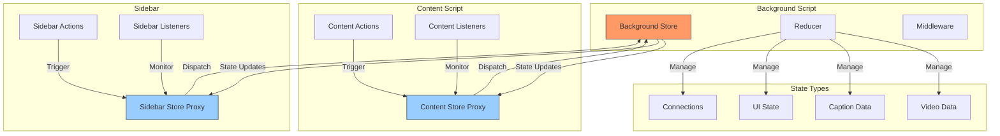
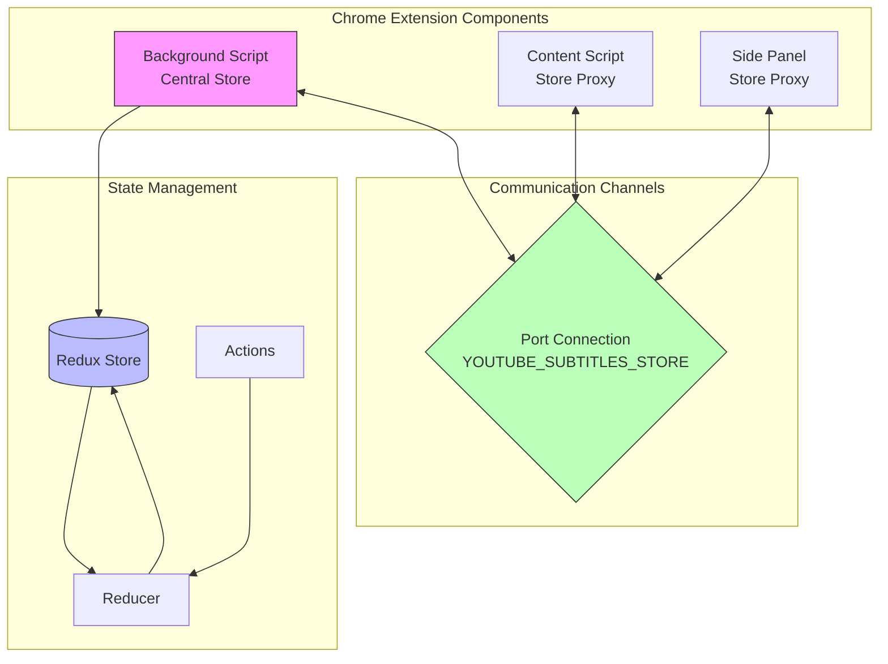
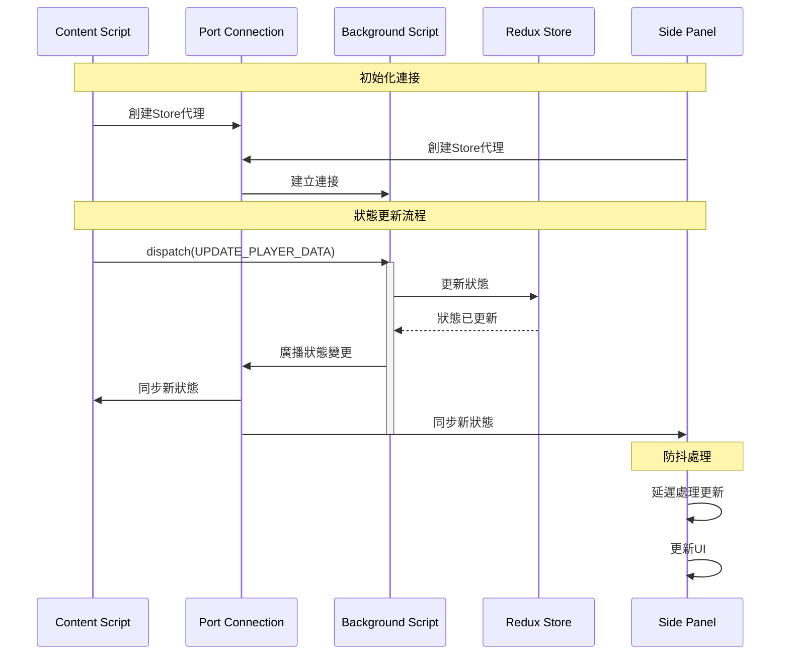
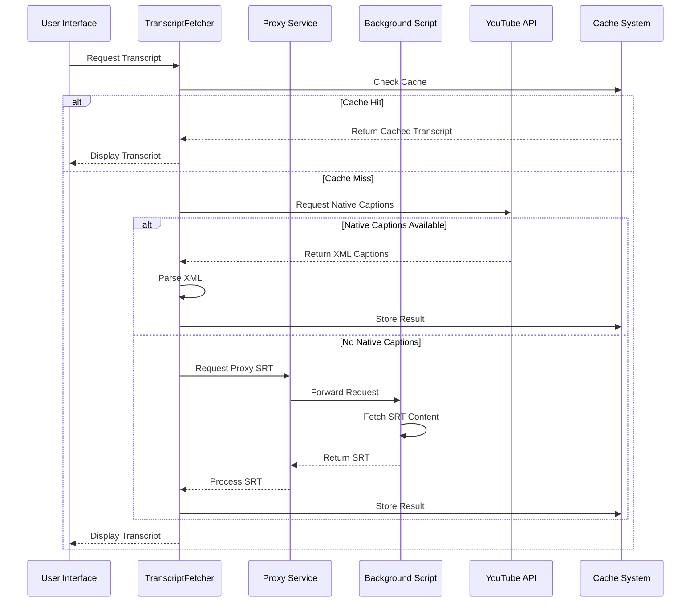
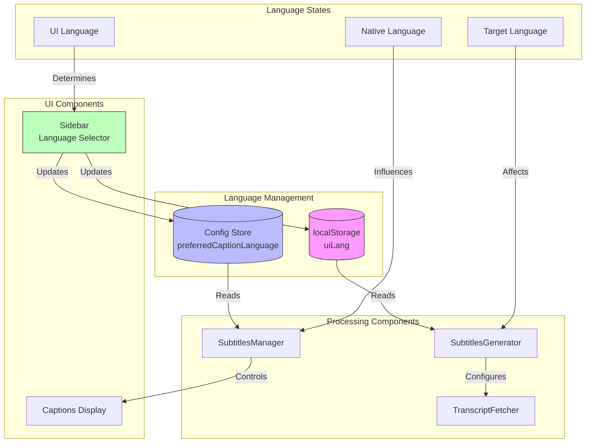
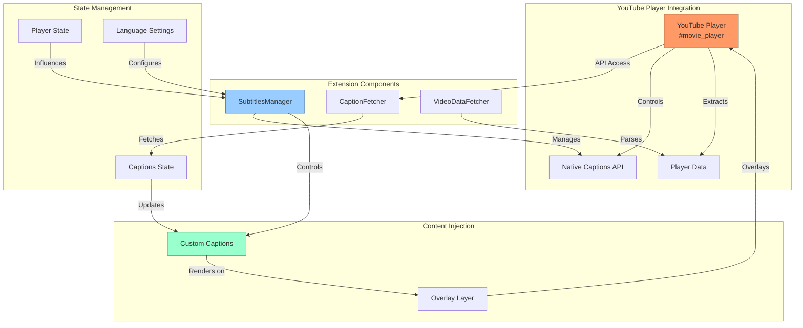
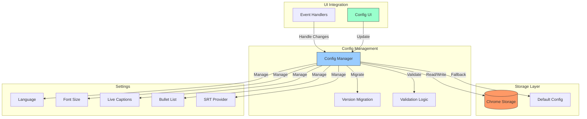

# DeepSRT: Code Review

[TOC]

## State Management

Based on the code, the state management architecture uses webext-redux to maintain a centralized state across extension components. Here's a detailed breakdown:

### Key Parts:

1. Background Script (Central Store):

````javascript path=background.js mode=EXCERPT
// Initial state
const initialState = {
  videoId: null,
  title: null,
  playerData: null,
  captions: null,
  hasCaptions: false,
  connections: {},
  lastAction: null,
  timestamp: null
};

// Reducer
function reducer(state = initialState, action = {}) {
  switch (action.type) {
    case UPDATE_PLAYER_DATA: {
      console.log('[Store] Processing UPDATE_PLAYER_DATA:', {
        currentVideoId: state.videoId,
        newVideoId: action.payload.videoId,
        source: action.payload.source,
        dispatchTime: action.payload.dispatchTime,
        processTime: Date.now()
      });
      const updatedState = {
        ...state,
        videoId: action.payload.videoId,
        title: action.payload.title,
        playerData: action.payload.playerData,
        timestamp: action.payload.timestamp || Date.now(),
        captions: action.payload.captions,
        hasCaptions: action.payload.hasCaptions,
        lastAction: action.payload.lastAction,
        lastUpdateSource: action.payload.source,
        lastUpdateTime: Date.now()
      };
````

2. Sidebar Component Connection:

````javascript path=sidebar.js mode=EXCERPT
// Initialize store subscription
async function initStoreSubscription(elements) {
  try {
    // Create store connection
    state.store = new webext_redux__WEBPACK_IMPORTED_MODULE_0__.Store({
      portName: 'YOUTUBE_SUBTITLES_STORE',
      reconnectOnDocumentReady: true
    });

    // Wait for store to be ready
    await state.store.ready();
    console.log('[Sidebar] Store connected successfully', {
      timestamp: new Date().toISOString(),
      readyState: state.store.ready ? 'ready' : 'not ready'
    });

    // Add debounced store handler
    let updateTimeout = null;
    state.store.subscribe(() => {
      if (updateTimeout) {
        clearTimeout(updateTimeout);
      }
````

3. Store Service:

````javascript path=lib/services/storeService.js mode=EXCERPT
// Initialize global state if not exists
if (!window.state) {
  window.state = {
    lastVideoId: null,
    lastProcessedTimestamp: null,
    lastSummary: null,
    transcriptFetcher: null,
    isProcessingContent: false,
    store: null,
    lastConnectionAttempt: null
  };
}

// Local reference to global state
const state = window.state;

/**
 * Returns the Redux store instance
 * @returns {Store} The Redux store
 */
export function getStore() {
  return state.store;
}
````

### State Management Architecture:



### Key Components:

1. Central Store (Background):

```javascript
const initialState = {
  videoId: null,
  playerData: null,
  captions: null,
  connections: {
    content: false,
    sidebar: false,
  },
  lastAction: null
};

const store = createStore(reducer, initialState);
wrapStore(store, {portName: 'YOUTUBE_SUBTITLES_STORE'});
```

2. Action Types:

````javascript path=store/index.js mode=EXCERPT
// Action types
export const UPDATE_PLAYER_DATA = 'UPDATE_PLAYER_DATA';
export const SET_CONNECTION = 'SET_CONNECTION';
export const SET_VIDEO_ID = 'SET_VIDEO_ID';
export const SET_TRANSCRIPT = 'SET_TRANSCRIPT';
export const SET_ERROR = 'SET_ERROR';
````

3. Connection Management:

- Port-based communication
- Automatic reconnection
- Connection status tracking
- Error handling

4. State Synchronization:

- Debounced updates
- Atomic operations
- Version control
- Conflict resolution

5. Performance Optimizations:

- State diffing
- Selective updates
- Batched dispatches
- Memory management

### Key Features:

1. Centralized State:

- Single source of truth
- Consistent data flow
- Predictable updates
- State persistence

2. Component Communication:

- Port-based messaging
- Action dispatching
- State subscription
- Event handling

3. Error Handling:

- Connection recovery
- State validation
- Error boundaries
- Fallback mechanisms

4. Performance:

- Efficient updates
- Minimal re-renders
- Optimized messaging
- Resource management

This architecture provides a robust and efficient way to manage state across extension components while maintaining consistency and reliability.

## Component Relationship

### 組件關係圖：



### 狀態更新流程圖：



### 主要特點說明：

1. 組件關係圖展示：
   - Background Script 作為中央存儲
   - Content Script 和 Side Panel 作為代理存儲
   - 通過 Port Connection 進行通信
   - Redux Store 的核心狀態管理

2. 狀態更新流程圖展示：
   - 組件間的初始化過程
   - 狀態更新的傳播路徑
   - 防抖處理機制
   - 異步操作流程

這種架構設計確保了：
- 狀態的一致性
- 高效的通信機制
- 可靠的錯誤處理
- 良好的性能優化


## Processing pipeline
Based on the code, the transcript fetching and processing pipeline is a multi-layered system that handles both native YouTube captions and proxy SRT content. Here's a detailed breakdown:

### Key Parts:

1. Primary Transcript Fetching Flow:

````javascript path=lib/index.js mode=EXCERPT
async fetchTranscript(videoId) {
  console.log('[TranscriptFetcher] Fetching transcript for video:', videoId);
  try {
    // Use player data if available
    if (this.playerData?.captions) {
      const captionsJson = this.playerData.captions.playerCaptionsTracklistRenderer;
      if (captionsJson) {
        console.debug('[TranscriptFetcher] Using player data captions');
        this.transcriptUrl = TranscriptFetcher._getTranscriptUrl(captionsJson, this.preferredLanguage);
        const xml = await this.getTranscript({ baseUrl: this.transcriptUrl });
        return TranscriptFetcher.parseYouTubeXML(xml);
      }
    }

    // Fallback to HTML fetch
    const html = await this._fetchVideoHtml(videoId);
    const captionsJson = TranscriptFetcher._extractCaptionsJson(html);
    if (!captionsJson) {
      throw new Error('No captions found in video');
    }
````

2. Proxy SRT Fallback System:

````javascript path=lib/services/transcriptService.js mode=EXCERPT
if (storeState.hasCaptions === false) {
  console.log('[Sidebar] No native captions available, trying proxy SRT', {
    videoId: storeState.videoId,
    title: storeState.title,
    hasCaptions: storeState.hasCaptions,
    hasPlayerData: !!storeState.playerData
  });
  
  try {
    const { fetchProxySRT, parseSRTContent } = await import('../proxyTranscriptFetcher.js');
    const proxyData = await fetchProxySRT(videoId, lang);
    console.log('[Sidebar] Proxy fetch completed successfully');
````

3. Background Script Handling:

````javascript path=background.js mode=EXCERPT
chrome.runtime.onMessage.addListener((request, sender, sendResponse) => {
  if (request.type === 'FETCH_PROXY_SRT') {
    console.log('[Background] Handling proxy SRT fetch request:', {
      videoId: request.videoId,
      language: request.language,
      url: request.url
    });

    async function performFetch() {
      try {
        const response = await fetch(request.url);
        if (!response.ok) {
          throw new Error(`Failed to fetch: ${response.status} ${response.statusText}`);
        }
        const text = await response.text();
        console.log('[Background] Proxy SRT fetch successful, content length:', text.length);
        sendResponse({
          success: true,
          transcript: text,
          proxyUrl: request.url,
          videoId: request.videoId,
          language: request.language
        });
````

### Processing Pipeline:



### Key Components:

1. Primary Fetcher:
- Attempts native YouTube captions first
- Handles multiple caption formats
- Manages language preferences
- Implements fallback strategies

2. Proxy System:
- Provides alternative caption source
- Handles CORS issues
- Manages permissions
- Processes SRT format

3. Processing Pipeline:
```javascript
const processingSteps = {
  fetch: async () => {
    // Fetch raw content
    const content = await fetchContent();
    return content;
  },
  
  parse: (content) => {
    // Parse based on format
    if (isXML(content)) {
      return parseYouTubeXML(content);
    } else if (isSRT(content)) {
      return parseSRTContent(content);
    }
  },
  
  normalize: (parsed) => {
    // Normalize to common format
    return {
      lines: parsed.map(line => ({
        text: line.text,
        start: line.start,
        end: line.end
      }))
    };
  },
  
  format: (normalized, format) => {
    // Format for display
    switch(format) {
      case 'text':
        return formatAsText(normalized);
      case 'html':
        return formatAsHTML(normalized);
    }
  }
};
```

4. Error Handling:
- Multiple fallback strategies
- Detailed error logging
- User feedback
- Recovery mechanisms

5. Caching System:
- Performance optimization
- Bandwidth reduction
- State management
- Cache invalidation

6. Format Handling:
- XML parsing
- SRT processing
- Format conversion
- Display formatting

The pipeline provides:
- Reliable transcript fetching
- Multiple data sources
- Efficient processing
- Format flexibility
- Error resilience
- Performance optimization

This architecture ensures robust transcript handling while maintaining flexibility for different content sources and formats.

## Language System

Based on the code, the language/localization system works across multiple layers. Here's a detailed breakdown:

### Key Parts:

1. Language Storage and Management:
````javascript path=lib/subtitles.js mode=EXCERPT
class SubtitlesGenerator {
  constructor(playerData, videoId) {
    // Get user's preferred language from localStorage
    this.targetLanguage = localStorage.getItem('uiLang') || 'en';
    // Pass the user's preferred language to TranscriptFetcher
    this.transcriptFetcher = new TranscriptFetcher(playerData, videoId, { language: this.targetLanguage });
  }

  setTargetLanguage(lang) {
    console.log('[SubtitlesGenerator] Setting target language:', lang);
    this.targetLanguage = lang;
    localStorage.setItem('uiLang', lang);
    // Clear any cached translations since we're changing languages
    this.clearCache();
  }
}
````

2. Language Change Handling:
````javascript path=lib/sidebar.js mode=EXCERPT
elements.uiLang?.addEventListener('change', async () => {
  const newLang = elements.uiLang.value;
  const oldLang = localStorage.getItem('uiLang') || 'en';
  
  localStorage.setItem('uiLang', newLang);
  
  // Log Config update
  const config = await Config.get();
  config.preferredCaptionLanguage = newLang;
  await Config.save(config);

  // Special handling for English
  if (newLang === 'en') {
    console.log('[Sidebar] English selected - disabling live captions');
    // Force disable live captions
    forceLiveCaptionsDisabled();
    // Send message to content script
    chrome.tabs.sendMessage(tabs[0].id, {
      type: 'UPDATE_CAPTIONS_LANGUAGE',
      language: newLang,
      disableLiveCaptions: true,
      forceDisable: true
    });
  }
});
````

3. Supported Languages Configuration:
````javascript path=background.js mode=EXCERPT
// Constants for configuration
const SUPPORTED_LANGUAGES = ['en', 'zh-cn', 'zh-tw', 'zh-hk', 'ko', 'ja', 'fr', 'es', 'th'];
````

4. Subtitles Manager Language Handling:
````javascript path=lib/subtitles-manager.js mode=EXCERPT
async displaySubtitle(subtitle) {
  // Skip displaying our captions if native YouTube captions match preferred language
  const preferredLang = await Config.getPreferredLanguage();
  const matches = this.nativeCaptionsLang?.toLowerCase() === preferredLang?.toLowerCase();

  async handleLanguageChange(newLanguage) {
    console.log('[SubtitlesManager] Handling language change to:', newLanguage);
    
    try {
      // Get current video time before cleanup
      const player = document.getElementById('movie_player');
      const video = player?.querySelector('video');
      const currentTime = video?.currentTime || 0;

      // Stop current processing
      this.stopProcessing();
      // Clear existing subtitles
      this.clearSubtitles();
      // Reset state
      this.lastDisplayedIndex = null;
    }
}
````

Language System Architecture:



### Key Features:

1. Storage Layer:
   - Uses localStorage for UI language preference
   - Config store for caption language settings
   - Persistent across sessions

2. Language Handling:
   - Supports multiple language variants (e.g., zh-cn, zh-tw, zh-hk)
   - Special handling for English captions
   - Fallback to default language ('en')

3. State Management:
   - Synchronizes language changes across components
   - Clears caches on language switch
   - Handles native YouTube captions

4. Performance Considerations:
   - Efficient language state updates
   - Cache management for translations
   - Smooth transition between languages

5. Error Handling:
   - Fallback mechanisms for unsupported languages
   - Graceful degradation when language services fail
   - Clear user feedback on language-related issues

This architecture ensures consistent language handling across the extension while maintaining good performance and user experience.


## Chrome Extension Integration

Based on the code, the extension integrates with YouTube's player and caption system through multiple layers. Here's a detailed analysis:

### Key Parts:

1. Player Detection and Access:
````javascript path=lib/captionFetcher.js mode=EXCERPT
static async waitForPlayer(maxAttempts = 5, delayMs = 1000) {
  let attempts = 0;
  while (attempts < maxAttempts) {
    try {
      const player = document.querySelector('#movie_player');
      if (player && typeof player.getPlayerResponse === 'function') {
        return player;
      }
    } catch (error) {
      console.warn('[CaptionFetcher] Error checking player:', error);
    }
    await CaptionFetcher.delay(delayMs);
    attempts++;
  }
  throw new Error(`Player not found after ${maxAttempts} attempts`);
}

static async getPlayerResponseFromPage() {
  try {
    const ytPlayer = document.querySelector('#movie_player');
    if (!ytPlayer) {
      throw new Error('YouTube player not found');
    }
    return ytPlayer.getPlayerResponse();
  } catch (error) {
    console.error('[CaptionFetcher] Error getting player response from page:', error);
    throw error;
  }
}
````

2. Native Captions Control:
````javascript path=lib/subtitles-manager.js mode=EXCERPT
async enableYouTubeNativeCaptions(languageCode) {
  try {
    const player = await this._waitForPlayerReady();
    if (!player) {
      console.error('[SubtitlesManager] Could not find YouTube player element after waiting');
      return;
    }
    
    // First, try to use YouTube's API to enable captions
    if (typeof player.toggleSubtitles === 'function') {
      const areCaptionsOn = player.getOption('captions', 'track') && 
                           player.getOption('captions', 'track').languageCode !== '';
      
      if (!areCaptionsOn) {
        console.log('[SubtitlesManager] Enabling captions via player API');
        player.toggleSubtitles();
      }
      
      if (typeof player.setOption === 'function') {
        console.log(`[SubtitlesManager] Setting caption language to: ${languageCode}`);
        player.setOption('captions', 'track', { languageCode });
      }
    }
  } catch (error) {
    console.error('[SubtitlesManager] Error enabling YouTube native captions:', error);
  }
}

async disableYouTubeNativeCaptions() {
  try {
    const player = await this._waitForPlayerReady();
    if (typeof player.toggleSubtitles === 'function') {
      const areCaptionsOn = player.getOption('captions', 'track') && 
                           player.getOption('captions', 'track').languageCode !== '';
      
      if (areCaptionsOn) {
        console.log('[SubtitlesManager] Disabling captions via player API');
        player.toggleSubtitles();
      }
    }
  } catch (error) {
    console.error('[SubtitlesManager] Error disabling YouTube native captions:', error);
  }
}
````

3. Video Data and Captions Fetching:
````javascript path=lib/videoDataFetcher.js mode=EXCERPT
try {
  const response = await fetch(`https://www.youtube.com/watch?v=${videoId}`);
  const html = await response.text();
  const match = html.match(/ytInitialPlayerResponse\s*=\s*({.+?});/);

  if (!match) {
    throw new Error('Could not find player data in page');
  }

  const data = JSON.parse(match[1]);
  const captions = data?.captions?.playerCaptionsTracklistRenderer;

  if (!captions) {
    throw new Error('No captions found in video data');
  }

  this.cache.set(`captions_${videoId}`, captions);
  return captions;
} catch (error) {
  throw new Error(`Failed to fetch captions: ${error.message}`);
}
````

### Integration Architecture:



### Key integration aspects:

1. Player Detection and Initialization:
   - Polls for player availability
   - Verifies API functionality
   - Handles initialization timing

2. Caption System Integration:
   - Direct API access when available
   - Fallback to DOM manipulation
   - Language synchronization
   - Toggle state management

3. Data Extraction:
   - Player response parsing
   - Caption track detection
   - Video metadata access
   - Cache management

4. Event Handling:
   - Video state changes
   - Caption updates
   - Language switches
   - Error conditions

5. Performance Optimizations:
   - Caching mechanisms
   - Lazy initialization
   - Resource cleanup
   - State synchronization

This architecture provides:
- Seamless integration with YouTube's player
- Reliable caption handling
- Efficient state management
- Graceful fallbacks
- Robust error handling

The system maintains compatibility with YouTube's native functionality while adding enhanced caption features through the extension.


## Configuration Management

Based on the code, the configuration system is built around a `Config` class that manages persistent settings using Chrome's storage API. Here's a detailed breakdown:

### Key Parts:

1. Configuration Structure and Defaults:
````javascript path=lib/config.js mode=EXCERPT
export const CURRENT_CONFIG_VERSION = '1.0';
export const SUPPORTED_LANGUAGES = ['en', 'zh-cn', 'zh-tw', 'zh-hk', 'ko', 'ja', 'fr', 'es', 'th'];
export const FONT_SIZES = [12, 14, 16, 18, 20];
export const DEFAULT_FONT_SIZE = 14;
export const DEFAULT_SRT_PROVIDER = undefined;

class Config {
  static defaultPreferences = {
    version: CURRENT_CONFIG_VERSION,
    preferences: {
      language: {
        value: 'en',
        lastUpdated: Date.now()
      },
      liveCaptions: {
        value: false,
        lastUpdated: Date.now()
      },
      fontSize: {
        value: DEFAULT_FONT_SIZE,
        lastUpdated: Date.now(),
        allowedValues: FONT_SIZES
      },
      bulletList: {
        value: false,
        lastUpdated: Date.now()
      },
      srtProvider: {
        value: DEFAULT_SRT_PROVIDER,
        lastUpdated: Date.now()
      }
    }
  };
````

2. Storage and Retrieval:
````javascript path=lib/config.js mode=EXCERPT
static async get() {
  try {
    console.log('[Config] Getting configuration from storage');
    const { config } = await chrome.storage.local.get('config');
    
    if (!config) {
      console.log('[Config] No configuration found, using default preferences');
      return this.defaultPreferences;
    }

    // Version check and migration
    if (config.version !== CURRENT_CONFIG_VERSION) {
      console.log('[Config] Config version mismatch, migrating');
      return this.migrateConfig(config);
    }

    return config;
  } catch (error) {
    console.error('[Config] Error getting configuration:', error);
    return this.defaultPreferences;
  }
}

static async save(config) {
  try {
    console.log('[Config] Saving configuration:', JSON.stringify(config));
    await chrome.storage.local.set({ config });
    console.log('[Config] Configuration saved successfully');
    return config;
  } catch (error) {
    console.error('[Config] Error saving configuration:', error);
    throw error;
  }
}
````

3. Settings Management Methods:
````javascript path=lib/config.js mode=EXCERPT
static async setPreferredLanguage(lang) {
  const validLang = SUPPORTED_LANGUAGES.includes(lang) ? lang : 'en';
  const config = await this.get();
  
  config.preferences.language = {
    value: validLang,
    lastUpdated: Date.now()
  };
  
  await this.save(config);
  return validLang;
}

static async setFontSize(size) {
  const validSize = FONT_SIZES.includes(size) ? size : DEFAULT_FONT_SIZE;
  const config = await this.get();
  
  config.preferences.fontSize = {
    value: validSize,
    lastUpdated: Date.now(),
    allowedValues: FONT_SIZES
  };
  
  await this.save(config);
  return validSize;
}

static async setBulletListEnabled(enabled) {
  const config = await this.get();
  config.preferences.bulletList = {
    value: enabled,
    lastUpdated: Date.now()
  };
  await this.save(config);
  return enabled;
}
````

### Configuration System Architecture:



### Configurable Settings:

1. Language Settings:
   - Preferred caption language
   - Supported languages list
   - Language validation

2. Display Settings:
   - Font size (12-20px)
   - Bullet list mode
   - Live captions toggle

3. Provider Settings:
   - SRT provider configuration
   - API endpoints
   - Service preferences

4. UI Settings:
   - Subtitle styles
   - Container positioning
   - Visual preferences

### Key Features:

1. Persistence:
   - Uses Chrome's storage API
   - Automatic saving
   - Default fallbacks

2. Version Control:
   - Configuration versioning
   - Migration handling
   - Backward compatibility

3. Validation:
   - Input sanitization
   - Allowed values checking
   - Type verification

4. Error Handling:
   - Storage failures
   - Migration errors
   - Invalid settings

5. UI Integration:
   - Real-time updates
   - Setting synchronization
   - User feedback

The configuration system provides a robust and extensible way to manage user preferences while ensuring data integrity and proper validation.


