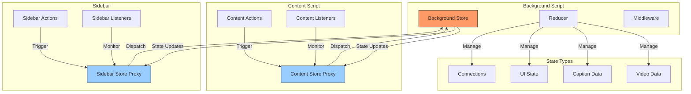
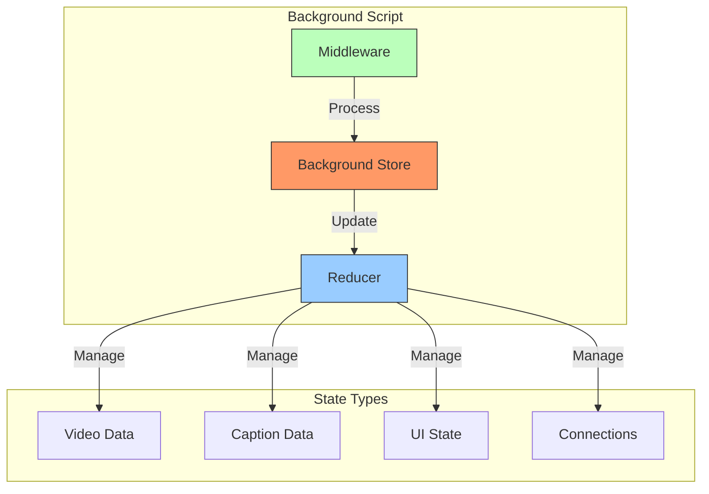
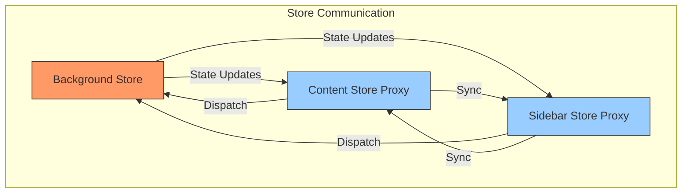
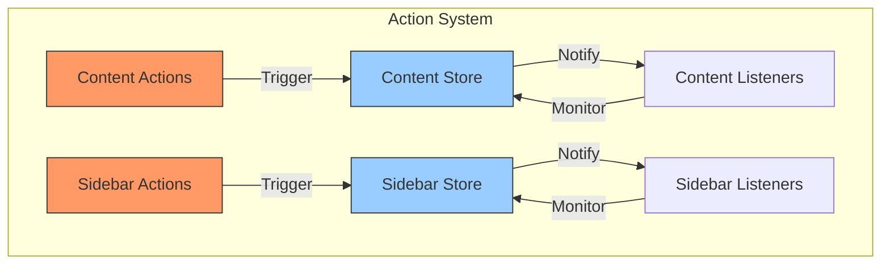

I'll break down the state management architecture into three focused diagrams:

1. Core Store Architecture:

2. Component Communication:

3. Action and Listener Flow:

These diagrams better illustrate:
1. The core state management structure
2. How components communicate with each other
3. The action and listener relationships within components

Each diagram focuses on a specific aspect of the architecture, making it easier to understand the different layers of the system.
