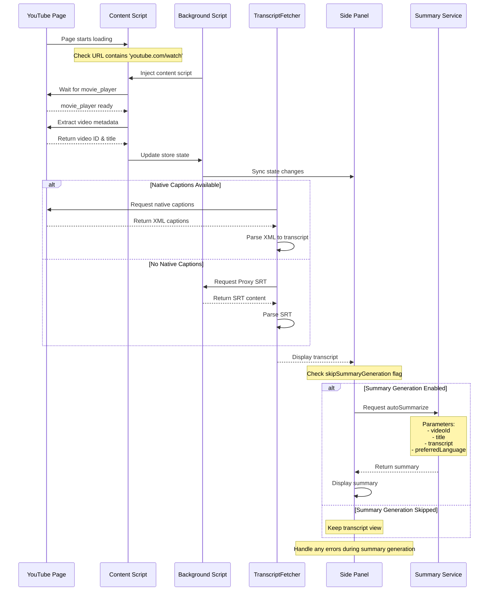

根據代碼，從 YouTube 載入到生成摘要的完整流程如下：


</div>

關鍵程式碼部分：

1. 摘要生成請求：
````javascript path=sidebar.js mode=EXCERPT
if (!skipSummaryGeneration) {
  try {
    console.log('[Sidebar] Summary request details:', {
      videoId: storeState.videoId,
      title: storeState.title,
      preferredLanguage: storeState.preferredLanguage,
      state: storeState
    });
    const targetLang = storeState.preferredLanguage;
    await autoSummarize({
      videoId: storeState.videoId,
      title: storeState.title,
      transcriptArg,
      preferredLanguage: targetLang
    }, content, targetLang);
  } catch (summaryError) {
    console.error('[Sidebar] Error generating summary:', summaryError);
  }
}
````

2. 代理內容的摘要處理：
````javascript path=lib/services/transcriptService.js mode=EXCERPT
if (!skipSummaryGeneration) {
  try {
    console.log('[Sidebar] Generating summary for proxy SRT content:', {
      videoId: storeState.videoId,
      title: storeState.title,
      preferredLanguage: storeState.preferredLanguage
    });
    
    const targetLang = storeState.preferredLanguage;
    await autoSummarize({
      videoId: storeState.videoId,
      title: storeState.title,
      isProxySource: true,
      preferredLanguage: targetLang,
      proxy: storeState.proxy
    }, content, targetLang);
  } catch (summaryError) {
    console.error('[Sidebar] Error generating summary for proxy content:', summaryError);
  }
}
````

這個流程的主要特點：
1. 確保在獲得完整字幕後才開始生成摘要
2. 支援多語言處理
3. 有錯誤處理機制
4. 可以通過 `skipSummaryGeneration` 標誌控制是否生成摘要
5. 支援原生字幕和代理字幕兩種來源的摘要生成