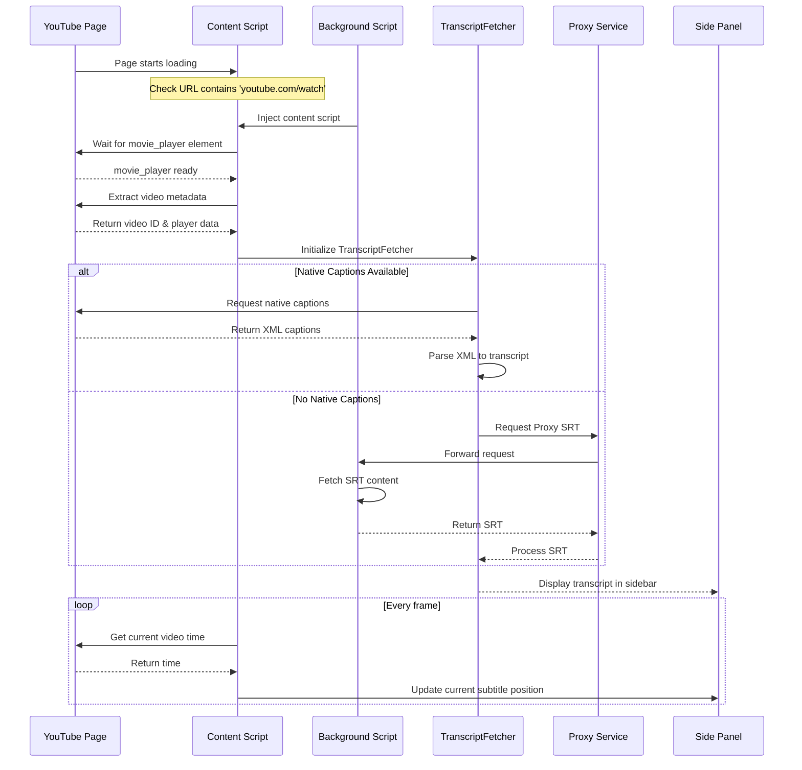

根據提供的代碼，我會將 YouTube 頁面載入到顯示字幕的完整流程繪製如下：


</augment_code_snippet>

關鍵步驟說明：

1. 初始化階段：
````javascript path=background.js mode=EXCERPT
chrome.tabs.onUpdated.addListener((tabId, changeInfo, tab) => {
  if (tab.url?.includes('youtube.com/watch') && changeInfo.status === 'complete') {
    injectContentScript(tabId);
  }
});
````

2. 獲取影片資訊：
````javascript path=lib/index.js mode=EXCERPT
async fetchTranscript(videoId) {
  if (this.playerData?.captions) {
    const captionsJson = this.playerData.captions.playerCaptionsTracklistRenderer;
    if (captionsJson) {
      this.transcriptUrl = TranscriptFetcher._getTranscriptUrl(captionsJson, this.preferredLanguage);
      const xml = await this.getTranscript({ baseUrl: this.transcriptUrl });
      return TranscriptFetcher.parseYouTubeXML(xml);
    }
  }
````

3. 字幕獲取邏輯：
````javascript path=lib/services/transcriptService.js mode=EXCERPT
if (storeState.hasCaptions === false) {
  const { fetchProxySRT, parseSRTContent } = await import('../proxyTranscriptFetcher.js');
  const proxyData = await fetchProxySRT(videoId, lang);
}
````

4. 字幕顯示更新：
````javascript path=lib/subtitles-manager.js mode=EXCERPT
this.updateInterval = setInterval(() => {
  const player = document.getElementById('movie_player');
  const video = player.querySelector('video');
  const currentTime = video.currentTime;
  
  const subtitle = this.subtitlesGenerator.getCurrentSubtitle(currentTime);
  if (subtitle) {
    this.displaySubtitle(subtitle);
  }
});
````

這個流程確保了：
- 正確的腳本注入時機
- 字幕資源的優先順序（原生 > 代理）
- 即時的字幕同步更新
- 錯誤處理和回退機制